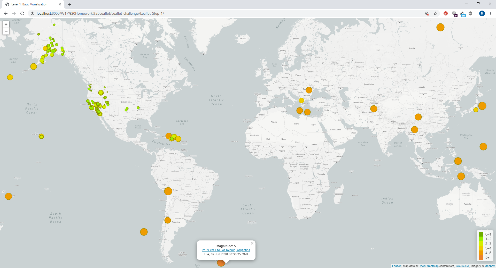
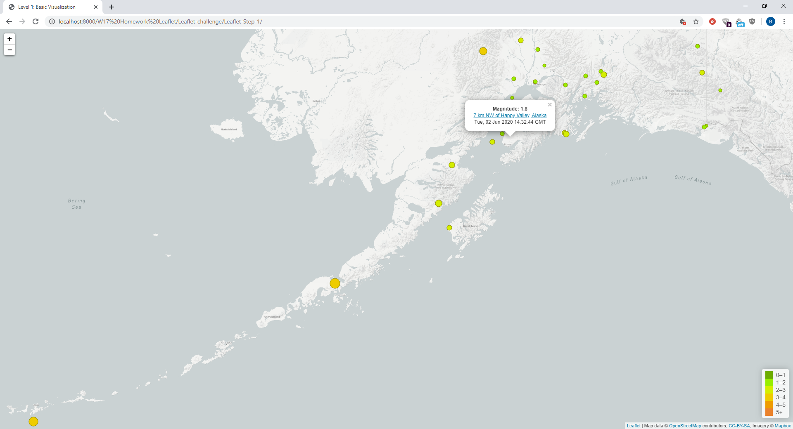
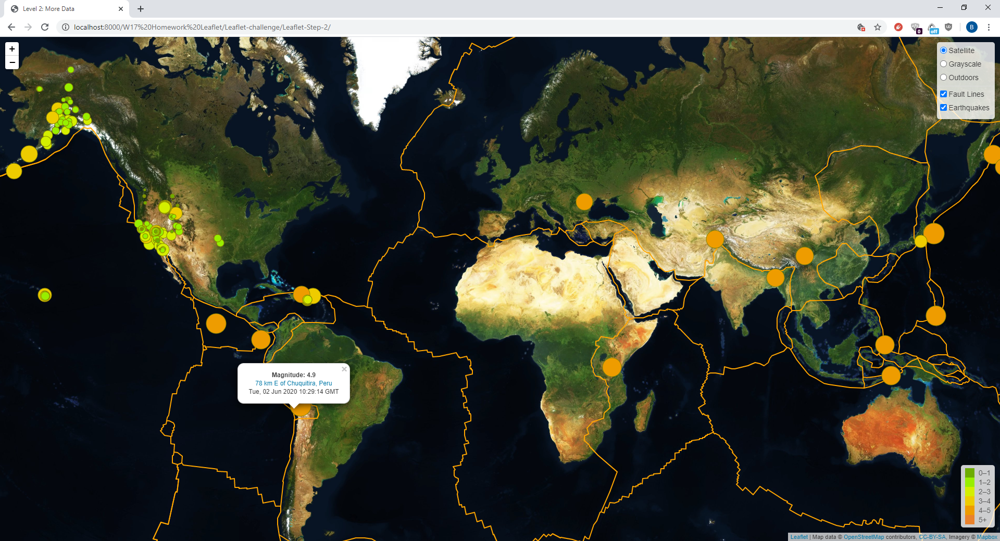
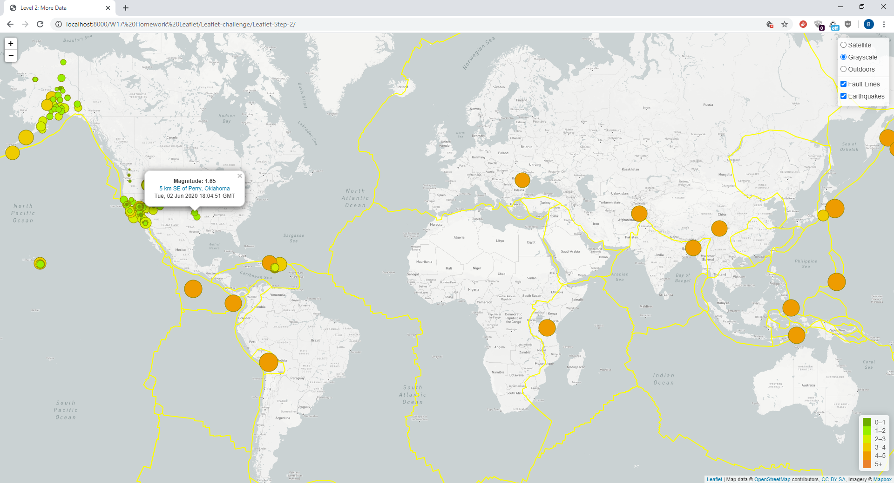
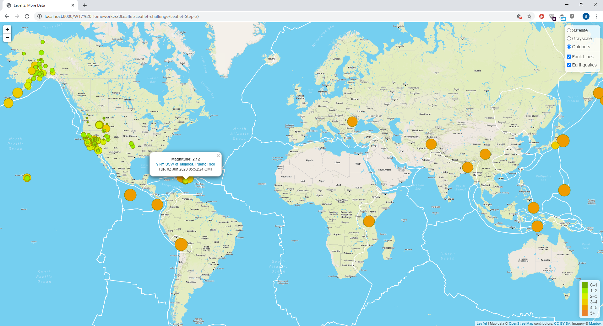
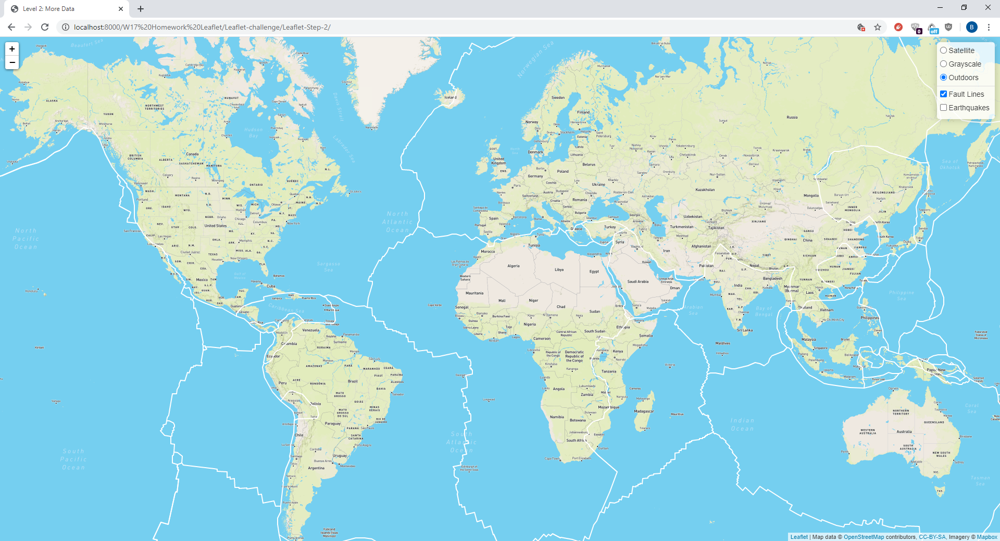

# Leaflet-challenge
UT-TOR-DATA-PT-01-2020-U-C Week 17 Homework

## Level 1: Basic Visualization

| Full Map | Alaska |
| -------- | ------ |
|  |  |

## Level 2: More Data

| Satellite | Grayscale |
| --------- | --------- |
|  |  |
| Outdoors | Fault Lines only |
|  |  |
